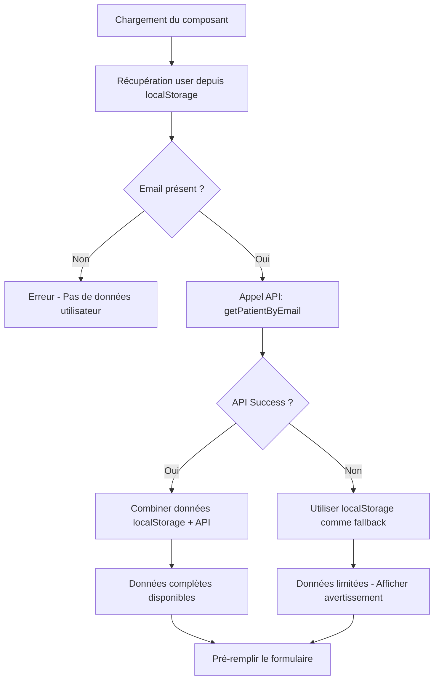

# Amélioration de l'Algorithme de Récupération des Données Patient

## Problème Identifié

Le localStorage ne contenait que des informations limitées sur l'utilisateur :
```json
{
  "_id": "68727eb8dc8177f29d8435eb",
  "email": "jojolapin@malagasy.com", 
  "role": "patient",
  "token": "eyJhbGciOiJIUzI1NiIsInR5cCI6IkpXVCJ9..."
}
```

**❌ Problème** : Les informations essentielles comme le nom et le prénom étaient manquantes, ce qui causait des problèmes lors de la création des rendez-vous.

## Solution Implémentée

### 1. Nouvelle Route API Backend

**Fichier** : `BACKEND/controllers/PatientController.js`
- Ajout de la fonction `getPatientByEmail()` pour récupérer un patient par son email
- Protection avec authentification et autorisation

**Fichier** : `BACKEND/routes/patientRoutes.js`
- Nouvelle route : `GET /api/patients/by-email/:email`

### 2. Service API Frontend

**Fichier** : `FRONTEND/src/lib/api.js`
- Service `patientService` avec intercepteur d'authentification automatique
- Fonction `getPatientByEmail()` pour récupérer les données complètes

### 3. Hook Personnalisé

**Fichier** : `FRONTEND/src/lib/hooks/usePatientData.js`
- Hook `usePatientData()` qui combine localStorage et API
- Gestion automatique du chargement et des erreurs
- Fallback sur localStorage en cas d'erreur API

### 4. Mise à Jour du Composant

**Fichier** : `FRONTEND/src/components/FormulaireDeReservation.jsx`
- Utilisation du nouveau hook pour récupérer les données
- Affichage d'indicateurs de chargement et d'erreur
- Avertissement si les données sont incomplètes

## Nouvel Algorithme



## Résultat

### Avant (localStorage uniquement)
```json
{
  "patientId": "ID-PATIENT-1234567890",
  "patientNom": "Non renseigné",
  "patientEmail": "jojolapin@malagasy.com",
  "patientTelephone": "Non renseigné",
  "patientAge": "Non renseigné"
}
```

### Après (localStorage + API)
```json
{
  "patientId": "688f4583bc62a9c109eeeabc",
  "patientNom": "Jojo Lapin",
  "patientEmail": "jojolapin@malagasy.com", 
  "patientTelephone": "0123456789",
  "patientAge": 30
}
```

## Avantages

✅ **Données Complètes** : Nom, prénom, téléphone et âge récupérés depuis la base de données
✅ **Robustesse** : Fallback sur localStorage en cas d'erreur API
✅ **Performance** : Données mises en cache et chargement asynchrone
✅ **UX Améliorée** : Indicateurs de chargement et messages d'erreur
✅ **Sécurité** : Authentification requise pour accéder aux données
✅ **Maintenabilité** : Code organisé avec hooks et services réutilisables

## Test

Le fichier `BACKEND/test-patient-data.js` permet de tester l'implémentation :

```bash
cd BACKEND
node test-patient-data.js
```

## Compatibilité

- ✅ Compatible avec l'ancien système (fallback sur localStorage)
- ✅ Pas de breaking changes pour les utilisateurs existants
- ✅ Migration progressive possible